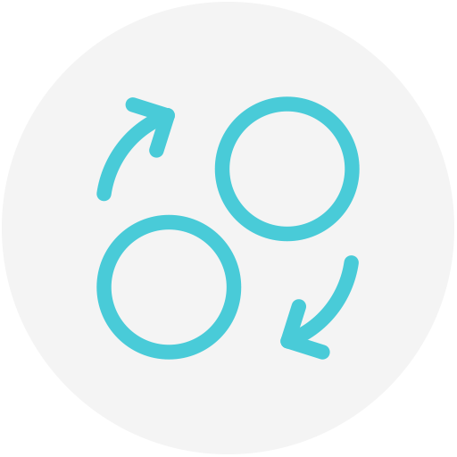

 
 

  

 
 
 

  

 

# 💵 Rial
A simple MacBook Touch Bar application to show USD, Euro, 750 Gold per gram and [Bahar Azadi Coin](https://en.wikipedia.org/wiki/Bahar_Azadi_Coin) live prices in [Rial](https://en.wikipedia.org/wiki/Iranian_rial) on your touch bar.   This project implemented in [Persian language](https://en.wikipedia.org/wiki/Persian_language) by [Electron](https://github.com/electron/electron) and use [tgju.org](http://www.tgju.org) website API to get the latest prices.

### Download and Install:
**[Version 1.1.0](https://github.com/soroushchehresa/Rial/releases/download/v1.1.0/Rial-1.1.0.dmg
)** (Just for MacBooks with Touch Bar)
